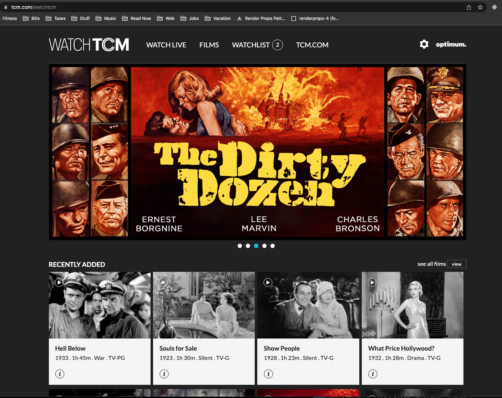
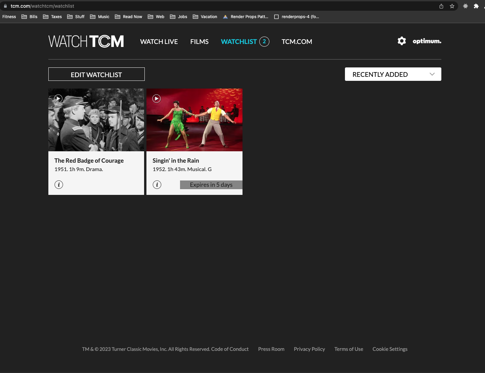
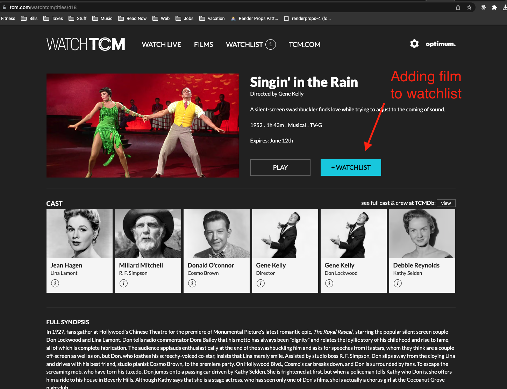
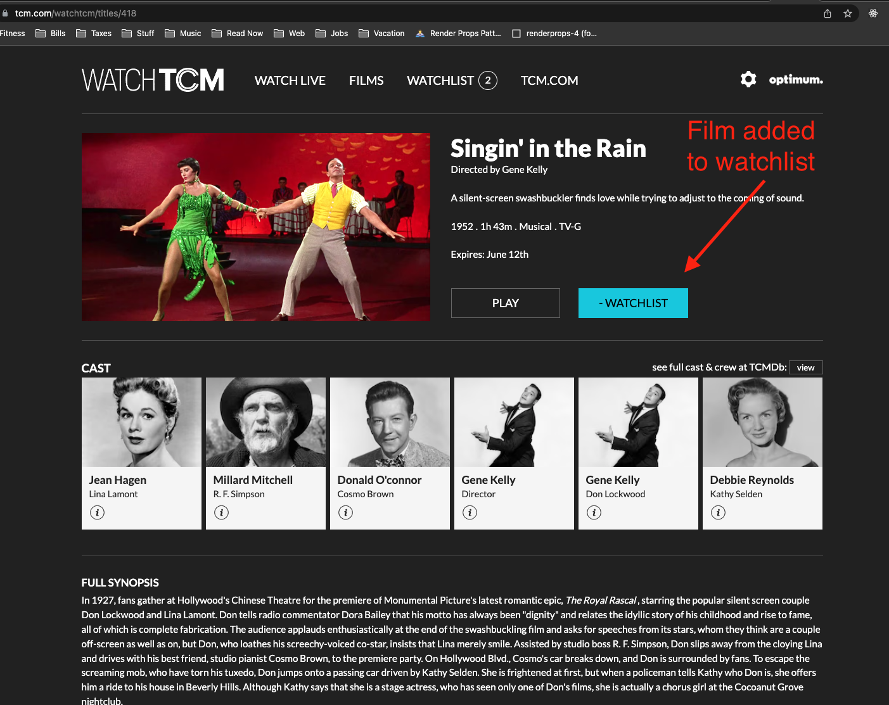

<!-- ABOUT THE PROJECT -->
## Excerpt from https://www.tcm.com/watchtcm 

  
  
    
    

Excerpt from https://www.tcm.com/watchtcm showing implementation of cookie-based watchlist. 
Example uses module design pattern to check/set or read cookie for an authenticated user.  
Convert to array for read/update, then stringify for cookie storage.

Code sample is non-functional and for review purposes only. 

(<a href="#readme-top">back to top</a>)

### Built With

* Vanilla Javascript

(<a href="#readme-top">back to top</a>)

<!-- GETTING STARTED -->
## Getting Started

This is not a functioning application, just an excerpt of code that runs in a larger application. 

<!-- USAGE EXAMPLES -->
## Usage

<!-- CONTACT -->
## Contact

Your Name - [@twitter_handle](https://twitter.com/Sean_McIntyre) - sean_mcintyre@hotmail.com.com

Project Link: [https://github.com/garrisonfield1/cookie-based-watchlist](https://github.com/garrisonfield1/cookie-based-watchlist)

